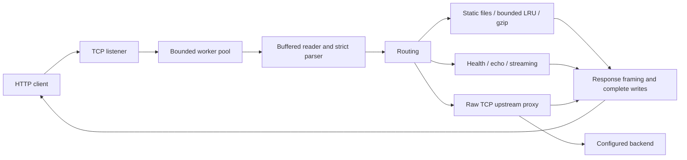

# HTTP/1.1 server and reverse proxy from raw TCP

A Python standard-library project implementing HTTP framing, concurrent connections, static representations, and a configured reverse proxy over raw sockets. It is a learning implementation with a documented protocol subset.

See the [supported HTTP subset and limitations](docs/HTTP.md).

## Architecture



`src/http_request.py` validates requests. `src/transport.py` owns buffered reads and writes. `src/application.py` routes requests. `src/static_files.py` and `src/file_cache.py` implement file representations. `src/proxy.py` implements the upstream hop. `src/webserver.py` configures connections, workers, deadlines, logs, and shutdown.

## Run

Requires Python 3.11+ on Linux or macOS. No pip dependencies.

```sh
python3 -m src.webserver --port 6789
curl http://127.0.0.1:6789/
curl -I http://127.0.0.1:6789/static/
curl --data-binary 'hello' http://127.0.0.1:6789/echo
curl --compressed http://127.0.0.1:6789/static/
```

The default document root is `src/` regardless of the working directory. Use `--document-root ./public` for an existing directory. `python3 src/webserver.py` also works.

## Two-service demo

```sh
# Terminal 1
python3 examples/backend.py --port 8000
# Terminal 2
python3 -m src.webserver --upstream http://127.0.0.1:8000
# Terminal 3
curl http://127.0.0.1:6789/api/health
curl --data-binary 'backend echo' http://127.0.0.1:6789/api/echo
```

`/static/*` serves local files; `/api/*` strips `/api` before forwarding to the configured origin. [Proxy contract](docs/PROXY.md) documents rewriting, headers, deadlines, and failures. Stop services with Ctrl-C.

## Configuration

| Options | Defaults / behavior |
|---|---|
| `--host`, `--port`, `--document-root` | `127.0.0.1`, `6789`, `src/` |
| `--workers`, `--queue-size` | 8 workers, 16 queued connections; overload returns 503 |
| `--max-headers`, `--max-body`, `--max-requests` | 32 KiB headers, 1 MiB decoded body, 100 requests per connection |
| `--header-timeout`, `--body-timeout` | 5 s headers, 10 s body |
| `--write-timeout`, `--idle-timeout` | 5 s per write, 2 s between requests |
| `--shutdown-timeout` | 2 s drain, then close remaining clients |
| `--upstream` | Optional HTTP origin for API routes |
| `--upstream-connect-timeout`, `--upstream-response-timeout` | 2 s connect; 10 s header/body phases |
| `--cache-bytes` | 8 MiB shared payload budget; 0 disables storage |
| `--access-log`, `--error-log` | Optional paths for JSON-line logs |

Run `python3 -m src.webserver --help` for all options. [Static cache policy](docs/CACHE.md) describes validators, eviction, and gzip eligibility.

## Verify

See [performance evidence and reproducible scripts](docs/PERFORMANCE.md) for recorded throughput, latency, errors, CPU/RSS, proxy overhead, and cache/compression tradeoffs.

```sh
python3 -m unittest discover -s tests -v
```

The suite uses temporary ports and document roots. It exercises fragmentation, pipelining, binary bodies, strict framing, chunking, deadlines, overload, shutdown, proxy failures/streaming, cache lifecycle, and compression. [GitHub Actions](.github/workflows/tests.yml) runs it on Python 3.11 and 3.13.
